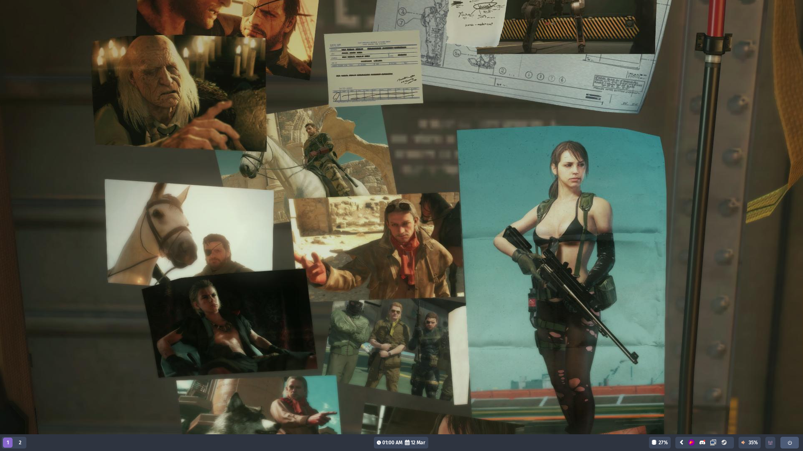
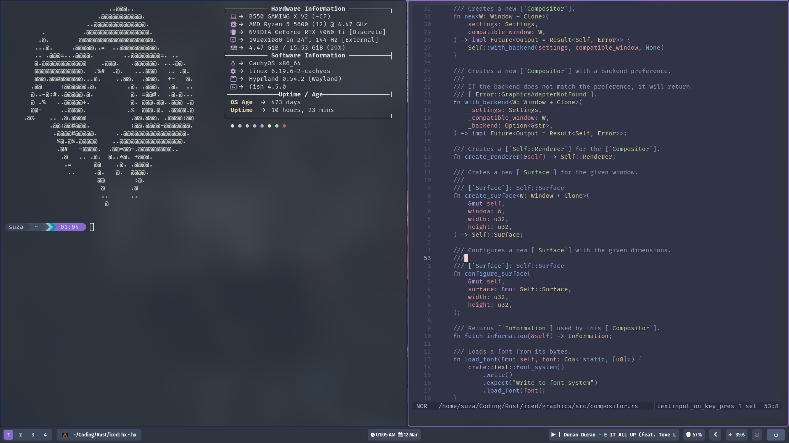
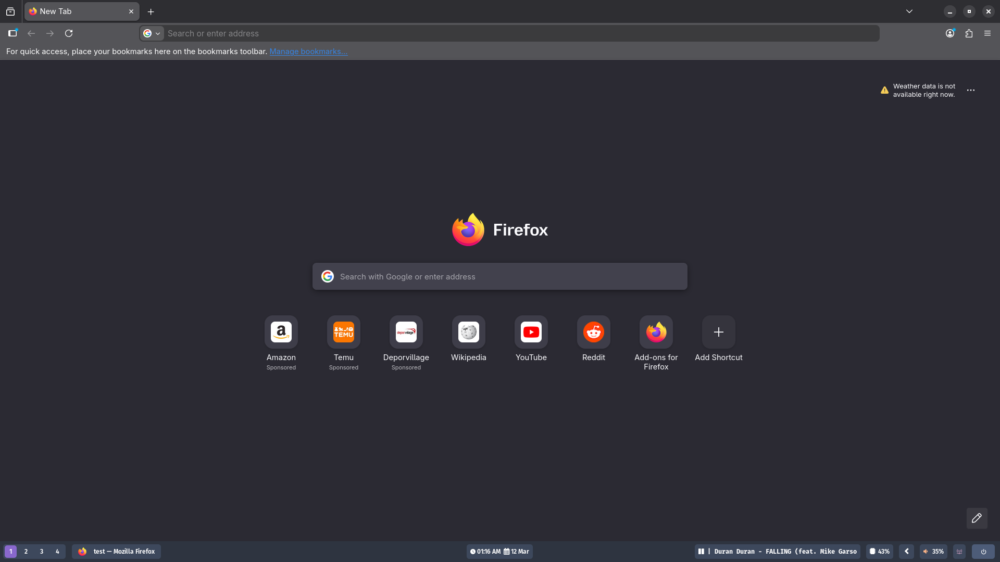
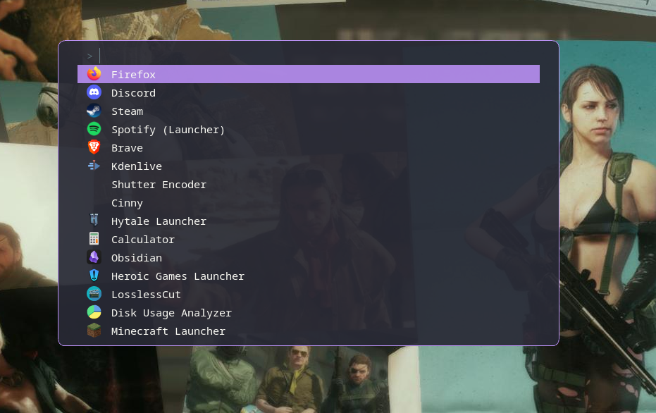

<div align="center">
  <h1>tsuza's dotfiles</h1>
</div>

| Clean Desktop | Coding Setup |
|:---|:---------------|
|  |  |
| A Single Window | Fuzzel |
|  |  |


## Overview
This repo contains my personal dotfiles for linux.

**My setup includes**:
- **Distro:** [CachyOS](https://cachyos.org/);
- **DE:** [Hyprland](https://hypr.land/);
  - Utilities: [Waybar](https://github.com/Alexays/Waybar), [Hyprcursor](https://github.com/hyprwm/hyprcursor), [Hyprpaper](https://github.com/hyprwm/hyprpaper), [Hyprlock](https://github.com/hyprwm/hyprlock);
- **App Launcher:** [Fuzzel](https://codeberg.org/dnkl/fuzzel);
- **File Manager:** [Nautilus](https://gitlab.gnome.org/GNOME/nautilus)
- **Terminal**: [Alacritty](https://alacritty.org/);
- **Shell**: [Fish](https://fishshell.com/)
- **Text Editor:**: [Helix](https://helix-editor.com/);
- **Terminal Multiplexer:** [Zellij](https://alacritty.org/);

**Theme Configuration**:
- **Cusor Theme**: [hackneyed](https://gitlab.com/Enthymeme/hackneyed-x11-cursors);
- **General Theme**: [Nordic]()

## Installation
The setup is fully automated using [chezmoi](https://www.chezmoi.io). This tool will install all the required packages and configure the dotfiles.

Run the following command in your terminal:
```shell
sh -c "$(curl -fsLS get.chezmoi.io)" -- init --apply tsuza/dotfiles.git
```

You're set!
